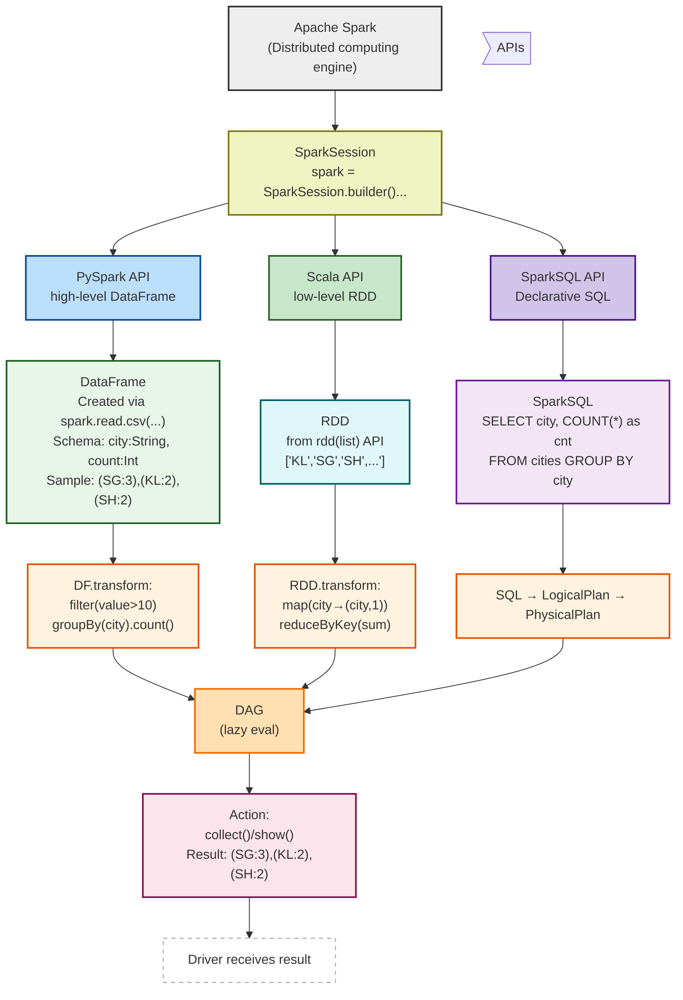

```mermaid
flowchart TB
  Spark["Apache Spark<br>(Distributed computing engine)"]
  Session["SparkSession<br>spark = SparkSession.builder()..."]
  APIs>APIs]  
  ScalaAPI["Scala API<br>low‑level RDD"]  
  PyAPI["PySpark API<br>high‑level DataFrame"]  
  SQLAPI["SparkSQL API<br>Declarative SQL"]  

  Spark --> Session
  Session --> ScalaAPI
  Session --> PyAPI
  Session --> SQLAPI

  ScalaAPI --> RDD["RDD<br>from rdd(list) API<br>['KL','SG','SH',...']"]
  PyAPI --> DF["DataFrame<br>Created via spark.read.csv(...)<br>Schema: city:String, count:Int<br>Sample: (SG:3),(KL:2),(SH:2)"]
  SQLAPI --> SQL["SparkSQL<br>SELECT city, COUNT(*) as cnt<br>FROM cities GROUP BY city"]

  RDD --> RDDtrans["RDD.transform:<br>map(city→(city,1))<br>reduceByKey(sum)"]
  DF --> DFtrans["DF.transform:<br>filter(value>10)<br>groupBy(city).count()"]
  SQL --> SQLplan["SQL → LogicalPlan → PhysicalPlan"]

  DFtrans & RDDtrans & SQLplan --> DAG["DAG<br>(lazy eval)"]
  DAG --> Action["Action:<br>collect()/show()<br>Result: (SG:3),(KL:2),(SH:2)"]
  Action --> Driver["Driver receives result"]

  style Spark fill:#eeeeee,stroke:#333,stroke-width:2px
  style Session fill:#f0f4c3,stroke:#827717,stroke-width:2px
  style ScalaAPI fill:#c8e6c9,stroke:#256029,stroke-width:2px
  style PyAPI fill:#bbdefb,stroke:#0d47a1,stroke-width:2px
  style SQLAPI fill:#d1c4e9,stroke:#4a148c,stroke-width:2px
  style DF fill:#e8f5e9,stroke:#1b5e20,stroke-width:2px
  style RDD fill:#e0f7fa,stroke:#006064,stroke-width:2px
  style SQL fill:#f3e5f5,stroke:#6a1b9a,stroke-width:2px
  style DFtrans fill:#fff3e0,stroke:#e65100,stroke-width:2px
  style RDDtrans fill:#fff3e0,stroke:#e65100,stroke-width:2px
  style SQLplan fill:#fff3e0,stroke:#e65100,stroke-width:2px
  style DAG fill:#ffe0b2,stroke:#ef6c00,stroke-width:2px
  style Action fill:#fce4ec,stroke:#880e4f,stroke-width:2px
  style Driver fill:#ffffff,stroke:#999,stroke-width:1px,stroke-dasharray:5 5

```
