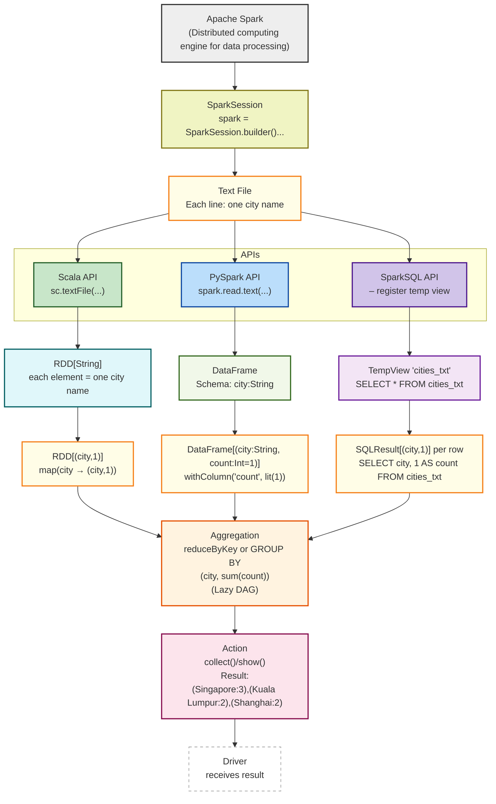
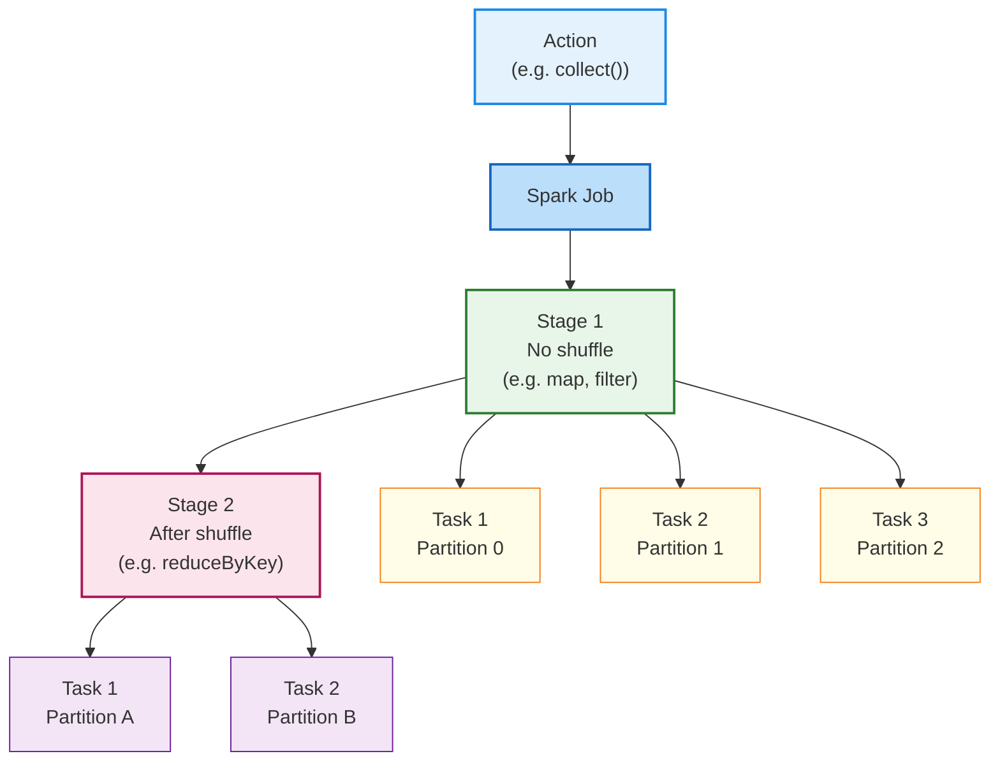

```mermaid
flowchart TB
    SPARK["Apache Spark<br>(Distributed computing engine for data processing)"]
    Session["SparkSession<br>spark = SparkSession.builder()..."]

    TextFile["Text File<br>Each line: one city name"]

    subgraph APIs
      direction TB
      ScalaAPI["Scala API<br>sc.textFile(...)"]
      PyAPI["PySpark API<br>spark.read.text(...)"]
      SQLAPI["SparkSQL API<br>– register temp view"]
    end

    SPARK --> Session
    Session --> TextFile
    TextFile --> ScalaAPI
    TextFile --> PyAPI
    TextFile --> SQLAPI

    ScalaAPI --> RDD1["RDD[String]<br>each element = one city name"]
    PyAPI   --> DF1["DataFrame<br>Schema: city:String"]
    SQLAPI  --> TempView["TempView 'cities_txt'<br>SELECT * FROM cities_txt"]

    RDD1 --> KV1["RDD[(city,1)]<br>map(city → (city,1))"]
    DF1  --> KV2["DataFrame[(city:String, count:Int=1)]<br>withColumn('count', lit(1))"]
    TempView --> SQL1["SQLResult[(city,1)] per row<br>SELECT city, 1 AS count FROM cities_txt"]

    KV1 & KV2 & SQL1 --> Reduce["Aggregation<br>reduceByKey or GROUP BY<br>(city, sum(count))<br>(Lazy DAG)"]
    Reduce --> Action["Action<br>collect()/show()<br>Result:<br>(Singapore:3),(Kuala Lumpur:2),(Shanghai:2)"]
    Action --> Driver["Driver<br>receives result"]

    style SPARK    fill:#eeeeee,stroke:#333,stroke-width:2px
    style Session  fill:#f0f4c3,stroke:#827717,stroke-width:2px
    style TextFile fill:#fffde7,stroke:#f57f17,stroke-width:2px
    style ScalaAPI fill:#c8e6c9,stroke:#256029,stroke-width:2px
    style PyAPI    fill:#bbdefb,stroke:#0d47a1,stroke-width:2px
    style SQLAPI   fill:#d1c4e9,stroke:#4a148c,stroke-width:2px
    style RDD1     fill:#e0f7fa,stroke:#006064,stroke-width:2px
    style DF1      fill:#f1f8e9,stroke:#33691e,stroke-width:2px
    style TempView fill:#f3e5f5,stroke:#6a1b9a,stroke-width:2px
    style KV1      fill:#fffde7,stroke:#f57f17,stroke-width:2px
    style KV2      fill:#fffde7,stroke:#f57f17,stroke-width:2px
    style SQL1     fill:#fffde7,stroke:#f57f17,stroke-width:2px
    style Reduce   fill:#fff3e0,stroke:#e65100,stroke-width:2px
    style Action   fill:#fce4ec,stroke:#880e4f,stroke-width:2px
    style Driver   fill:#ffffff,stroke:#999,stroke-width:1px,stroke-dasharray:5 5
```

---

```mermaid
flowchart TD
    A["Action<br>(e.g. collect())"]
    A --> Job["Spark Job"]

    Job --> Stage1["Stage 1<br>No shuffle<br>(e.g. map, filter)"]
    Stage1 --> Stage2["Stage 2<br>After shuffle<br>(e.g. reduceByKey)"]

    Stage1 --> T1["Task 1<br>Partition 0"]
    Stage1 --> T2["Task 2<br>Partition 1"]
    Stage1 --> T3["Task 3<br>Partition 2"]

    Stage2 --> T4["Task 1<br>Partition A"]
    Stage2 --> T5["Task 2<br>Partition B"]

    style A fill:#e3f2fd,stroke:#1e88e5,stroke-width:2px
    style Job fill:#bbdefb,stroke:#1565c0,stroke-width:2px
    style Stage1 fill:#e8f5e9,stroke:#2e7d32,stroke-width:2px
    style Stage2 fill:#fce4ec,stroke:#ad1457,stroke-width:2px
    style T1 fill:#fffde7,stroke:#f57f17
    style T2 fill:#fffde7,stroke:#f57f17
    style T3 fill:#fffde7,stroke:#f57f17
    style T4 fill:#f3e5f5,stroke:#6a1b9a
    style T5 fill:#f3e5f5,stroke:#6a1b9a
```
